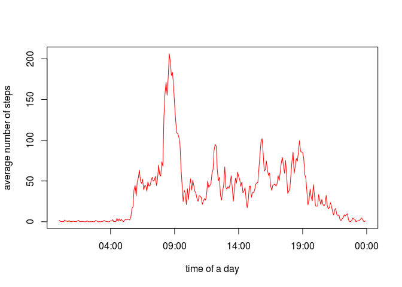
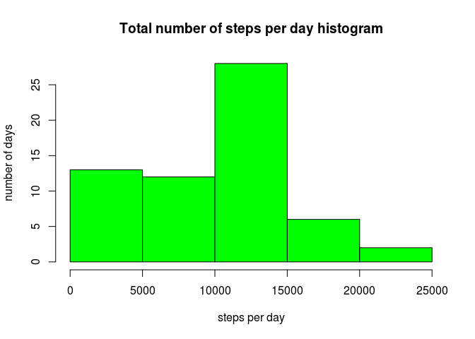
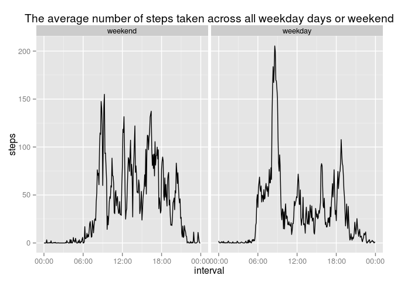

# Reproducible Research: Peer Assessment 1


## Loading and preprocessing the data

The [file from the task] [1] is alredy here. We read the csv into variable DATA, transform column **interval** in POSIX format and look at the dataset.  


```r
library(dplyr)
```

```
## 
## Attaching package: 'dplyr'
## 
## The following objects are masked from 'package:stats':
## 
##     filter, lag
## 
## The following objects are masked from 'package:base':
## 
##     intersect, setdiff, setequal, union
```

```r
library(ggplot2)
library(scales)

DATA <- read.csv('./activity.csv')
DATA <- DATA %>%
  mutate(interval = sprintf("%04d", interval)) %>%
  mutate(interval = as.POSIXct(strptime(interval, "%H%M")))
str(DATA)
```

```
## 'data.frame':	17568 obs. of  3 variables:
##  $ steps   : int  NA NA NA NA NA NA NA NA NA NA ...
##  $ date    : Factor w/ 61 levels "2012-10-01","2012-10-02",..: 1 1 1 1 1 1 1 1 1 1 ...
##  $ interval: POSIXct, format: "2015-10-18 00:00:00" "2015-10-18 00:05:00" ...
```

## What is mean total number of steps taken per day?

Here we calculate the total number of steps taken per day using split function:

```r
Tot.step.num <- sapply(split( DATA$steps,  DATA$date), function(x) sum(x, na.rm = TRUE))
```

Painting the histogram of the calculated data:

```r
hist(Tot.step.num, 
     main = "Total number of steps per day histogram",
     xlab = "steps per day",
     ylab = "number of days", 
     col = 'green')
```

 

```r
Meansteps <- mean(Tot.step.num, na.rm = TRUE)
Mediansteps <- median(Tot.step.num, na.rm = TRUE)
```
Summary of the total number of steps taken per day:

- mean value is eqal to 9354.2295082  
- median value is equal to 10395  

## What is the average daily activity pattern?

It is convenient and intuitively to use dplyr library for compute average :

```r
DATA.by.interval <- DATA %>%
  group_by(interval) %>%
  summarise(steps = mean(steps, na.rm = TRUE))
```

Use function plot from graphics library to make plot:

```r
with(DATA.by.interval, 
     plot(interval, steps, 
          type = 'l',
          col = 'red',
          xlab = 'time of a day',
          ylab = 'average number of steps'))
```

 

```r
Max.steps = DATA.by.interval[which(DATA.by.interval$steps == max(DATA.by.interval$steps)),]
```

The maximum number of steps contains 206.1698113 on average across all the days at 08:35. 

## Imputing missing values


```r
NAs <- sum(is.na(DATA$steps))
```

The number of missing values in column **steps** is equal to 2304. Now make up for it. Replace NA with median value in each interval through all the days. 


```r
DATAN <- DATA %>%
  group_by(interval) %>%
  mutate(fsteps = median(steps, na.rm = TRUE)) %>%
  mutate(steps = ifelse(is.na(steps), fsteps, steps)) 
```

Then calculate the total number of steps taken per day as in previous case:

```r
Tot.step.num <- sapply(split( DATAN$steps,  DATAN$date), function(x) sum(x, na.rm = TRUE))
```

And make the plot the same way:

```r
hist(Tot.step.num, 
     main = "Total number of steps per day histogram",
     xlab = "steps per day",
     ylab = "number of days", 
     col = 'green')
```

 

```r
NMeansteps <- mean(Tot.step.num, na.rm = TRUE)
NMediansteps <- median(Tot.step.num, na.rm = TRUE)
```

Summary of the total number of steps taken per day in new dataset:

- mean value is eqal to 9503.8688525  
- median value is equal to 10395 

So the diference with the previous dataset is not too serious. Also we can see that the graphics are similar. It means that the method of imputing missing values is not bad. 


## Are there differences in activity patterns between weekdays and weekends?

Add another column **WD** into the dataframe. There we put the information about merging days by weekday and weekend.

```r
df <- weekdays(as.Date(DATAN$date))
DATAN$WD <- as.logical(df == "Saturday" | df == "Sunday")
DATAN$WD <- factor(DATAN$WD, levels = c(T, F), labels = c("weekend", "weekday"))
```

Then calculate mean values per interval in each group and make plot. 

```r
DATAW <- DATAN %>%
  group_by(interval, WD) %>%
  summarise(steps = mean(steps))

plot1 <- ggplot(DATAW, aes(x = interval, y = steps)) +
  geom_line() +
  scale_x_datetime( labels = date_format("%H:%M", tz = "")) +
  facet_grid(.~ WD) +
  ggtitle("The average number of steps taken across all weekday days or weekend")

print(plot1)
```

 

We can see that the activity of the days is different. 

[1]: https://d396qusza40orc.cloudfront.net/repdata%2Fdata%2Factivity.zip 
